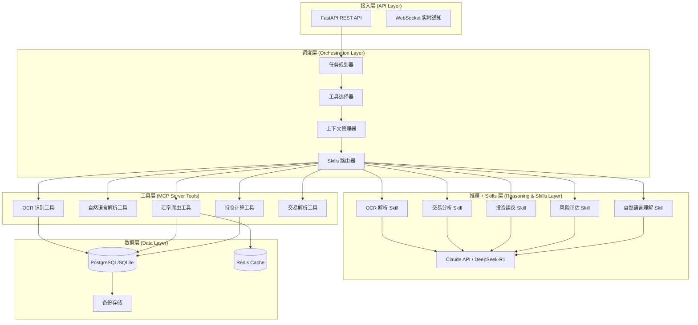

# 技术设计文档：智能外汇与债券投资追踪 Agent

## Overview

智能外汇与债券投资追踪 Agent 是一个基于 MCP Server 架构的自动化投资管理系统。系统采用分层架构设计，通过 FastAPI 提供 RESTful API 接口，使用 OCR 技术识别交易截图，爬取历史汇率数据计算持仓成本，并集成 AI 推理模型（Claude API 或 DeepSeek-R1）提供智能投资建议。

### 核心功能

1. **批量截图处理**：支持上传多张招商银行 APP 交易截图，通过 OCR 自动识别交易信息
2. **自然语言交易输入**：支持通过自然语言描述快速添加交易记录
3. **历史汇率爬取**：自动获取交易时间点的历史汇率数据，准确计算买入成本
4. **持仓成本计算**：使用加权平均法计算持仓成本，实时更新盈亏状况
5. **AI 投资建议**：基于持仓分析和市场趋势生成个性化投资建议
6. **数据持久化**：安全存储交易记录和持仓数据，支持备份和恢复

### 设计目标

- **模块化**：采用 MCP Server 架构实现工具层的独立性和可测试性
- **可扩展性**：支持新增货币类型、数据源和 AI 模型
- **高性能**：批量处理 50 张截图在 30 秒内完成，单次 OCR 识别在 5 秒内完成
- **可靠性**：99% 正常运行时间，支持降级运行和自动重试
- **安全性**：加密存储敏感数据，使用 HTTPS 通信，实现身份验证和授权

## Architecture

系统采用四层架构设计，从上到下分别为：接入层、调度层、工具层和数据层。

### 架构图



### 层次说明

#### 1. 接入层 (API Layer)

- **FastAPI REST API**：提供标准的 RESTful API 接口，处理 HTTP 请求
- **WebSocket**：提供实时通知功能，推送汇率更新和持仓变化

#### 2. 调度层 (Orchestration Layer)

调度层是系统的核心协调中枢，负责任务规划、工具选择、上下文管理和 Skills 路由：

- **任务规划器 (Task Planner)**：
  - 接收用户请求，分析任务类型和复杂度
  - 将复杂任务分解为多个子任务
  - 确定任务执行顺序和依赖关系
  - 示例：批量截图上传 → 拆分为单张处理 → OCR → 解析 → 验证 → 存储

- **工具选择器 (Tool Selector)**：
  - 根据任务类型选择合适的 MCP 工具
  - 评估工具可用性和性能
  - 实现工具降级策略（如 OCR 引擎切换）
  - 示例：汇率查询优先使用官方数据源，失败后切换到备用 API

- **上下文管理器 (Context Manager)**：
  - 维护对话历史和任务上下文
  - 管理中间结果和状态
  - 实现上下文压缩策略（摘要 + 滚动窗口）
  - 控制推理模型的 token 预算

- **Skills 路由器 (Skills Router)**：
  - 根据任务需求路由到合适的 Skill 或 MCP 工具
  - 管理 Skills 的版本和参数
  - 协调 Skills 与工具的协作
  - 示例：投资建议任务 → 路由到"投资建议 Skill" → 调用持仓计算工具 → 调用推理模型

#### 3. 工具层 (MCP Server Tools)

工具层采用 MCP Server 架构，每个工具都是独立的、可测试的模块：

- **OCR 识别工具** (`ocr_extract`)：调用 OCR 引擎提取截图文本
- **自然语言解析工具** (`parse_natural_language`)：解析用户的自然语言交易输入
- **汇率爬虫工具** (`get_exchange_rate`)：爬取历史和实时汇率数据
- **持仓计算工具** (`calculate_position`)：计算持仓成本、盈亏和收益率
- **投资建议工具** (`generate_advice`)：生成 AI 投资建议
- **交易解析工具** (`parse_transaction`)：将 OCR 文本转换为结构化交易数据

#### 4. 推理 + Skills 层 (Reasoning & Skills Layer)

推理 + Skills 层将 AI 推理能力封装为可复用的 Skills 模块，每个 Skill 是一个参数化的 prompt 模板：

**推理模型**：
- **Claude API / DeepSeek-R1**：核心推理引擎，支持 extended thinking 模式

**Skills 模块**：

1. **OCR 解析 Skill** (`ocr_parsing_skill`)
   - 功能：辅助解析复杂的 OCR 文本，提取结构化交易信息
   - 输入：OCR 原始文本、交易类型
   - 输出：结构化交易数据（JSON）
   - Prompt 模板：
     ```
     你是一个专业的金融交易数据解析专家。请从以下 OCR 文本中提取交易信息：
     
     OCR 文本：{ocr_text}
     交易类型：{transaction_type}
     
     请提取：币种/债券代码、数量、价格、交易时间、交易方向
     输出格式：JSON
     ```

2. **交易分析 Skill** (`transaction_analysis_skill`)
   - 功能：分析交易模式，识别异常交易
   - 输入：交易历史列表
   - 输出：交易模式分析报告
   - Prompt 模板：
     ```
     分析以下交易记录，识别交易模式和潜在问题：
     
     交易记录：{transactions}
     
     请分析：
     1. 交易频率和规律
     2. 异常交易（如大额交易、频繁买卖）
     3. 持仓集中度风险
     ```

3. **投资建议 Skill** (`investment_advice_skill`)
   - 功能：基于持仓和市场数据生成投资建议
   - 输入：持仓列表、市场数据、风险偏好
   - 输出：投资建议（JSON）
   - Prompt 模板：
     ```
     你是一位专业的投资顾问。基于以下信息提供投资建议：
     
     当前持仓：{positions}
     市场数据：{market_data}
     风险偏好：{risk_preference}
     
     请提供：
     1. 持仓分析
     2. 具体操作建议（持有/买入/卖出）
     3. 风险提示
     4. 建议理由
     
     输出格式：JSON
     ```

4. **风险评估 Skill** (`risk_assessment_skill`)
   - 功能：评估投资组合的风险水平
   - 输入：持仓列表、历史波动率
   - 输出：风险评估报告
   - Prompt 模板：
     ```
     评估以下投资组合的风险：
     
     持仓：{positions}
     历史波动率：{volatility_data}
     
     请评估：
     1. 整体风险等级（低/中/高）
     2. 主要风险因素
     3. 风险分散建议
     ```

5. **自然语言理解 Skill** (`natural_language_understanding_skill`)
   - 功能：解析用户的自然语言交易输入
   - 输入：用户输入文本
   - 输出：结构化交易参数
   - Prompt 模板：
     ```
     解析用户的交易输入，提取交易参数：
     
     用户输入：{user_input}
     
     请提取：
     - 币种/债券代码
     - 数量
     - 价格（如果提供）
     - 交易方向（买入/卖出）
     - 交易时间（如果提供）
     
     输出格式：JSON
     如果信息不完整，在 missing_fields 中列出缺失字段
     ```

**Skills 管理**：
- 每个 Skill 都有版本号，支持 A/B 测试
- Skills 参数可配置（temperature、max_tokens 等）
- Skills 可以组合使用（如：OCR 解析 + 交易分析）

#### 5. 数据层 (Data Layer)

- **PostgreSQL/SQLite**：主数据库，存储交易记录、持仓数据和用户信息
- **Redis Cache**：缓存层，存储历史汇率数据和计算结果
- **备份存储**：定期备份数据库，保留 30 天历史备份

### 数据流

1. **截图上传流程**：
   - 用户上传截图 → API 接收 → OCR 处理编排器 → OCR 识别工具 → 交易解析工具 → 数据库存储

2. **持仓计算流程**：
   - 用户请求持仓分析 → API 接收 → 持仓计算编排器 → 汇率爬虫工具（查询汇率）→ 持仓计算工具 → 返回结果

3. **AI 建议流程**：
   - 用户请求投资建议 → API 接收 → AI 建议编排器 → 投资建议工具 → Claude/DeepSeek API → 返回建议

## Components and Interfaces

### 核心组件

#### 1. OCR 识别模块 (OCR Recognition Module)

**职责**：从交易截图中提取文本信息

**接口**：
```python
class OCREngine:
    async def extract_text(
        self, 
        image: bytes, 
        language: str = "zh-CN"
    ) -> OCRResult:
        """
        从图像中提取文本
        
        Args:
            image: 图像字节数据
            language: OCR 识别语言
            
        Returns:
            OCRResult: 包含提取的文本和置信度
        """
        pass

@dataclass
class OCRResult:
    text: str
    confidence: float
    bounding_boxes: List[BoundingBox]
    metadata: Dict[str, Any]
```

**实现选择**：
- **Tesseract OCR**：开源方案，适合本地部署，识别率约 75-85%
- **百度 OCR API**：云服务，识别率约 90-95%，支持银行票据识别
- **腾讯 OCR API**：云服务，识别率约 90-95%，支持金融场景

**设计决策**：采用策略模式，支持多种 OCR 引擎切换，优先使用云服务（百度/腾讯），降级到 Tesseract

#### 2. 交易解析模块 (Transaction Parser Module)

**职责**：将 OCR 提取的文本转换为结构化交易数据

**接口**：
```python
class TransactionParser:
    def parse(
        self, 
        ocr_text: str, 
        transaction_type: TransactionType
    ) -> ParsedTransaction:
        """
        解析 OCR 文本为结构化交易数据
        
        Args:
            ocr_text: OCR 提取的文本
            transaction_type: 交易类型（外汇或债券）
            
        Returns:
            ParsedTransaction: 结构化交易数据
        """
        pass

@dataclass
class ParsedTransaction:
    transaction_type: TransactionType  # FOREX or BOND
    currency_or_bond: str  # 币种代码或债券代码
    quantity: Decimal
    price: Decimal
    transaction_time: datetime
    direction: TransactionDirection  # BUY or SELL
    confidence: float
    raw_text: str
```

**解析策略**：
- 使用正则表达式匹配关键字段（币种、数量、价格、时间）
- 使用 AI 模型（Claude/DeepSeek）辅助解析复杂格式
- 维护招商银行 APP 截图的模板库，提高识别准确率

#### 3. 汇率爬虫模块 (Exchange Rate Crawler Module)

**职责**：获取历史和实时汇率数据

**接口**：
```python
class ExchangeRateCrawler:
    async def get_historical_rate(
        self,
        from_currency: str,
        to_currency: str,
        date: datetime
    ) -> ExchangeRate:
        """
        获取历史汇率
        
        Args:
            from_currency: 源货币代码
            to_currency: 目标货币代码
            date: 查询日期
            
        Returns:
            ExchangeRate: 汇率数据
        """
        pass
    
    async def get_latest_rates(
        self,
        base_currency: str = "CNY"
    ) -> Dict[str, Decimal]:
        """
        获取最新汇率
        
        Args:
            base_currency: 基准货币
            
        Returns:
            Dict: 货币代码到汇率的映射
        """
        pass

@dataclass
class ExchangeRate:
    from_currency: str
    to_currency: str
    rate: Decimal
    date: datetime
    source: str
    is_estimated: bool = False
```

**数据源**：
- **中国人民银行**：官方汇率数据，权威可靠
- **ExchangeRate-API**：免费 API，支持历史数据查询
- **Fixer.io**：商业 API，数据更新频率高

**缓存策略**：
- 历史汇率：永久缓存（不会变化）
- 实时汇率：缓存 15 分钟
- 使用 Redis 存储，键格式：`rate:{from}:{to}:{date}`

**重试策略**：
- 失败后重试 3 次，间隔 5 秒
- 如果所有数据源都失败，使用最近可用的汇率并标记为估算值

#### 4. 持仓计算模块 (Position Calculator Module)

**职责**：计算持仓成本、盈亏和收益率

**接口**：
```python
class PositionCalculator:
    def calculate_position(
        self,
        transactions: List[Transaction],
        current_rates: Dict[str, Decimal]
    ) -> Position:
        """
        计算持仓信息
        
        Args:
            transactions: 交易记录列表
            current_rates: 当前汇率
            
        Returns:
            Position: 持仓信息
        """
        pass
    
    def calculate_weighted_average_cost(
        self,
        buy_transactions: List[Transaction]
    ) -> Decimal:
        """
        计算加权平均成本
        
        Args:
            buy_transactions: 买入交易列表
            
        Returns:
            Decimal: 加权平均成本
        """
        pass

@dataclass
class Position:
    currency_or_bond: str
    quantity: Decimal
    average_cost: Decimal  # 加权平均成本（CNY）
    current_value: Decimal  # 当前价值（CNY）
    unrealized_pnl: Decimal  # 未实现盈亏
    return_rate: Decimal  # 收益率（百分比）
    cost_basis: Decimal  # 成本基础
```

**加权平均成本算法**：
```
加权平均成本 = Σ(买入数量 × 买入时汇率 × 买入价格) / Σ(买入数量)
```

**盈亏计算**：
```
未实现盈亏 = 当前价值 - 成本基础
收益率 = (未实现盈亏 / 成本基础) × 100%
```

#### 5. AI 投资顾问模块 (Investment Advisor Module)

**职责**：生成基于 AI 推理的投资建议

**接口**：
```python
class InvestmentAdvisor:
    async def generate_advice(
        self,
        positions: List[Position],
        market_data: MarketData,
        risk_preference: RiskPreference
    ) -> InvestmentAdvice:
        """
        生成投资建议
        
        Args:
            positions: 当前持仓列表
            market_data: 市场数据
            risk_preference: 风险偏好
            
        Returns:
            InvestmentAdvice: 投资建议
        """
        pass

@dataclass
class InvestmentAdvice:
    summary: str  # 建议摘要
    recommendations: List[Recommendation]  # 具体建议
    risk_analysis: str  # 风险分析
    reasoning: str  # 建议理由
    generated_at: datetime

@dataclass
class Recommendation:
    currency_or_bond: str
    action: Action  # HOLD, BUY, SELL
    reason: str
    risk_level: RiskLevel  # LOW, MEDIUM, HIGH
```

**AI 模型调用策略**：
- 优先使用 Claude API（更强的推理能力）
- 降级到 DeepSeek-R1（成本更低）
- 使用结构化 prompt 确保输出格式一致

**Prompt 设计**：
```
你是一位专业的投资顾问。基于以下信息提供投资建议：

当前持仓：
{positions}

市场数据：
{market_data}

风险偏好：{risk_preference}

请提供：
1. 持仓分析
2. 具体操作建议（持有/买入/卖出）
3. 风险提示
4. 建议理由

输出格式：JSON
```

#### 6. 自然语言处理模块 (Natural Language Processor Module)

**职责**：解析用户的自然语言交易输入

**接口**：
```python
class NaturalLanguageProcessor:
    async def parse_transaction_input(
        self,
        user_input: str
    ) -> ParsedNLTransaction:
        """
        解析自然语言交易输入
        
        Args:
            user_input: 用户输入的自然语言
            
        Returns:
            ParsedNLTransaction: 解析结果
        """
        pass

@dataclass
class ParsedNLTransaction:
    currency_or_bond: Optional[str]
    quantity: Optional[Decimal]
    price: Optional[Decimal]
    direction: Optional[TransactionDirection]
    transaction_time: Optional[datetime]
    missing_fields: List[str]  # 缺失的字段
    confidence: float
```

**实现方式**：
- 使用 Claude/DeepSeek API 进行意图识别和实体提取
- 支持中英文输入
- 识别常见表达模式（"买入 1000 美元"、"卖出 500 欧元"）

#### 7. 数据存储模块 (Data Repository Module)

**职责**：管理交易记录和持仓数据的持久化

**接口**：
```python
class TransactionRepository:
    async def save_transaction(
        self,
        transaction: Transaction
    ) -> str:
        """保存交易记录"""
        pass
    
    async def get_transactions(
        self,
        filters: TransactionFilters
    ) -> List[Transaction]:
        """查询交易记录"""
        pass
    
    async def get_positions(
        self,
        user_id: str
    ) -> List[Position]:
        """获取用户持仓"""
        pass
```

### MCP Server 工具定义

所有工具层组件都实现为 MCP Server 工具，遵循标准的输入输出格式：

```python
# MCP 工具标准接口
class MCPTool:
    name: str
    description: str
    input_schema: Dict[str, Any]
    
    async def execute(self, params: Dict[str, Any]) -> Dict[str, Any]:
        """执行工具逻辑"""
        pass
```

**MCP 工具列表**：

1. **ocr_extract**
   - 输入：`{image: base64_string, language: string}`
   - 输出：`{text: string, confidence: float, bounding_boxes: array}`

2. **parse_transaction**
   - 输入：`{ocr_text: string, transaction_type: string}`
   - 输出：`{parsed_transaction: object, confidence: float}`

3. **get_exchange_rate**
   - 输入：`{from_currency: string, to_currency: string, date: string}`
   - 输出：`{rate: decimal, source: string, is_estimated: boolean}`

4. **calculate_position**
   - 输入：`{transactions: array, current_rates: object}`
   - 输出：`{position: object}`

5. **generate_advice**
   - 输入：`{positions: array, market_data: object, risk_preference: string}`
   - 输出：`{advice: object}`

6. **parse_natural_language**
   - 输入：`{user_input: string}`
   - 输出：`{parsed_transaction: object, missing_fields: array}`

## Data Models

### 数据库设计

系统使用关系型数据库（PostgreSQL 或 SQLite）存储数据，主要包含以下表：

#### 1. Users 表

存储用户信息和配置。

```sql
CREATE TABLE users (
    id UUID PRIMARY KEY DEFAULT gen_random_uuid(),
    username VARCHAR(100) UNIQUE NOT NULL,
    email VARCHAR(255) UNIQUE NOT NULL,
    password_hash VARCHAR(255) NOT NULL,
    risk_preference VARCHAR(20) DEFAULT 'MEDIUM',
    base_currency VARCHAR(3) DEFAULT 'CNY',
    created_at TIMESTAMP DEFAULT CURRENT_TIMESTAMP,
    updated_at TIMESTAMP DEFAULT CURRENT_TIMESTAMP
);

CREATE INDEX idx_users_username ON users(username);
CREATE INDEX idx_users_email ON users(email);
```

#### 2. Transactions 表

存储所有交易记录。

```sql
CREATE TABLE transactions (
    id UUID PRIMARY KEY DEFAULT gen_random_uuid(),
    user_id UUID NOT NULL REFERENCES users(id) ON DELETE CASCADE,
    transaction_type VARCHAR(20) NOT NULL, -- 'FOREX' or 'BOND'
    currency_or_bond VARCHAR(20) NOT NULL,
    quantity DECIMAL(20, 8) NOT NULL,
    price DECIMAL(20, 8) NOT NULL,
    direction VARCHAR(10) NOT NULL, -- 'BUY' or 'SELL'
    transaction_time TIMESTAMP NOT NULL,
    exchange_rate DECIMAL(20, 8), -- 交易时汇率（对于外汇）
    cost_in_base_currency DECIMAL(20, 2), -- 以基准货币计算的成本
    source VARCHAR(50) DEFAULT 'MANUAL', -- 'OCR', 'MANUAL', 'NLP'
    ocr_confidence DECIMAL(5, 4), -- OCR 识别置信度
    raw_data TEXT, -- 原始 OCR 文本或用户输入
    verified BOOLEAN DEFAULT FALSE, -- 是否已人工确认
    created_at TIMESTAMP DEFAULT CURRENT_TIMESTAMP,
    updated_at TIMESTAMP DEFAULT CURRENT_TIMESTAMP
);

CREATE INDEX idx_transactions_user_id ON transactions(user_id);
CREATE INDEX idx_transactions_currency_or_bond ON transactions(currency_or_bond);
CREATE INDEX idx_transactions_transaction_time ON transactions(transaction_time);
CREATE INDEX idx_transactions_direction ON transactions(direction);
```

#### 3. Positions 表

存储当前持仓信息（可以从 Transactions 计算得出，但缓存以提高性能）。

```sql
CREATE TABLE positions (
    id UUID PRIMARY KEY DEFAULT gen_random_uuid(),
    user_id UUID NOT NULL REFERENCES users(id) ON DELETE CASCADE,
    position_type VARCHAR(20) NOT NULL, -- 'FOREX' or 'BOND'
    currency_or_bond VARCHAR(20) NOT NULL,
    quantity DECIMAL(20, 8) NOT NULL,
    average_cost DECIMAL(20, 8) NOT NULL, -- 加权平均成本
    cost_basis DECIMAL(20, 2) NOT NULL, -- 成本基础（基准货币）
    current_value DECIMAL(20, 2), -- 当前价值（基准货币）
    unrealized_pnl DECIMAL(20, 2), -- 未实现盈亏
    return_rate DECIMAL(10, 4), -- 收益率（百分比）
    last_updated TIMESTAMP DEFAULT CURRENT_TIMESTAMP,
    created_at TIMESTAMP DEFAULT CURRENT_TIMESTAMP,
    UNIQUE(user_id, currency_or_bond)
);

CREATE INDEX idx_positions_user_id ON positions(user_id);
CREATE INDEX idx_positions_currency_or_bond ON positions(currency_or_bond);
```

#### 4. ExchangeRates 表

存储历史和实时汇率数据。

```sql
CREATE TABLE exchange_rates (
    id UUID PRIMARY KEY DEFAULT gen_random_uuid(),
    from_currency VARCHAR(3) NOT NULL,
    to_currency VARCHAR(3) NOT NULL,
    rate DECIMAL(20, 8) NOT NULL,
    rate_date DATE NOT NULL,
    source VARCHAR(50) NOT NULL, -- 'PBOC', 'ExchangeRateAPI', 'Fixer'
    is_estimated BOOLEAN DEFAULT FALSE,
    created_at TIMESTAMP DEFAULT CURRENT_TIMESTAMP,
    UNIQUE(from_currency, to_currency, rate_date, source)
);

CREATE INDEX idx_exchange_rates_currencies ON exchange_rates(from_currency, to_currency);
CREATE INDEX idx_exchange_rates_date ON exchange_rates(rate_date);
```

#### 5. InvestmentAdvice 表

存储 AI 生成的投资建议历史。

```sql
CREATE TABLE investment_advice (
    id UUID PRIMARY KEY DEFAULT gen_random_uuid(),
    user_id UUID NOT NULL REFERENCES users(id) ON DELETE CASCADE,
    summary TEXT NOT NULL,
    recommendations JSONB NOT NULL, -- 存储建议列表
    risk_analysis TEXT,
    reasoning TEXT,
    model_used VARCHAR(50), -- 'Claude', 'DeepSeek'
    generated_at TIMESTAMP DEFAULT CURRENT_TIMESTAMP
);

CREATE INDEX idx_investment_advice_user_id ON investment_advice(user_id);
CREATE INDEX idx_investment_advice_generated_at ON investment_advice(generated_at);
```

#### 6. AuditLogs 表

存储审计日志，记录所有重要操作。

```sql
CREATE TABLE audit_logs (
    id UUID PRIMARY KEY DEFAULT gen_random_uuid(),
    user_id UUID REFERENCES users(id) ON DELETE SET NULL,
    action VARCHAR(100) NOT NULL, -- 'UPLOAD_SCREENSHOT', 'ADD_TRANSACTION', etc.
    resource_type VARCHAR(50), -- 'TRANSACTION', 'POSITION', etc.
    resource_id UUID,
    details JSONB,
    ip_address INET,
    user_agent TEXT,
    created_at TIMESTAMP DEFAULT CURRENT_TIMESTAMP
);

CREATE INDEX idx_audit_logs_user_id ON audit_logs(user_id);
CREATE INDEX idx_audit_logs_action ON audit_logs(action);
CREATE INDEX idx_audit_logs_created_at ON audit_logs(created_at);
```

### 数据模型类（Python）

```python
from dataclasses import dataclass
from decimal import Decimal
from datetime import datetime
from enum import Enum
from typing import Optional, List, Dict, Any
from uuid import UUID

class TransactionType(str, Enum):
    FOREX = "FOREX"
    BOND = "BOND"

class TransactionDirection(str, Enum):
    BUY = "BUY"
    SELL = "SELL"

class RiskPreference(str, Enum):
    LOW = "LOW"
    MEDIUM = "MEDIUM"
    HIGH = "HIGH"

class Action(str, Enum):
    HOLD = "HOLD"
    BUY = "BUY"
    SELL = "SELL"

class RiskLevel(str, Enum):
    LOW = "LOW"
    MEDIUM = "MEDIUM"
    HIGH = "HIGH"

@dataclass
class User:
    id: UUID
    username: str
    email: str
    password_hash: str
    risk_preference: RiskPreference
    base_currency: str
    created_at: datetime
    updated_at: datetime

@dataclass
class Transaction:
    id: UUID
    user_id: UUID
    transaction_type: TransactionType
    currency_or_bond: str
    quantity: Decimal
    price: Decimal
    direction: TransactionDirection
    transaction_time: datetime
    exchange_rate: Optional[Decimal]
    cost_in_base_currency: Optional[Decimal]
    source: str
    ocr_confidence: Optional[Decimal]
    raw_data: Optional[str]
    verified: bool
    created_at: datetime
    updated_at: datetime

@dataclass
class Position:
    id: UUID
    user_id: UUID
    position_type: TransactionType
    currency_or_bond: str
    quantity: Decimal
    average_cost: Decimal
    cost_basis: Decimal
    current_value: Optional[Decimal]
    unrealized_pnl: Optional[Decimal]
    return_rate: Optional[Decimal]
    last_updated: datetime
    created_at: datetime

@dataclass
class ExchangeRate:
    id: UUID
    from_currency: str
    to_currency: str
    rate: Decimal
    rate_date: datetime
    source: str
    is_estimated: bool
    created_at: datetime

@dataclass
class InvestmentAdvice:
    id: UUID
    user_id: UUID
    summary: str
    recommendations: List[Dict[str, Any]]
    risk_analysis: Optional[str]
    reasoning: Optional[str]
    model_used: str
    generated_at: datetime
```

### Redis 缓存结构

```python
# 汇率缓存
# Key: rate:{from_currency}:{to_currency}:{date}
# Value: {"rate": "6.8", "source": "PBOC", "is_estimated": false}
# TTL: 永久（历史汇率）或 900 秒（实时汇率）

# 持仓缓存
# Key: position:{user_id}
# Value: JSON 序列化的持仓列表
# TTL: 300 秒

# OCR 结果缓存（用于去重）
# Key: ocr:{image_hash}
# Value: JSON 序列化的 OCR 结果
# TTL: 3600 秒
```

## Correctness Properties

