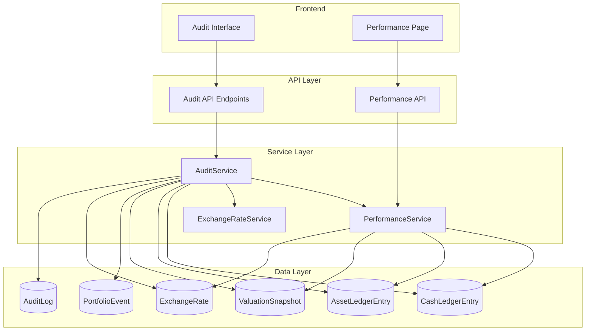
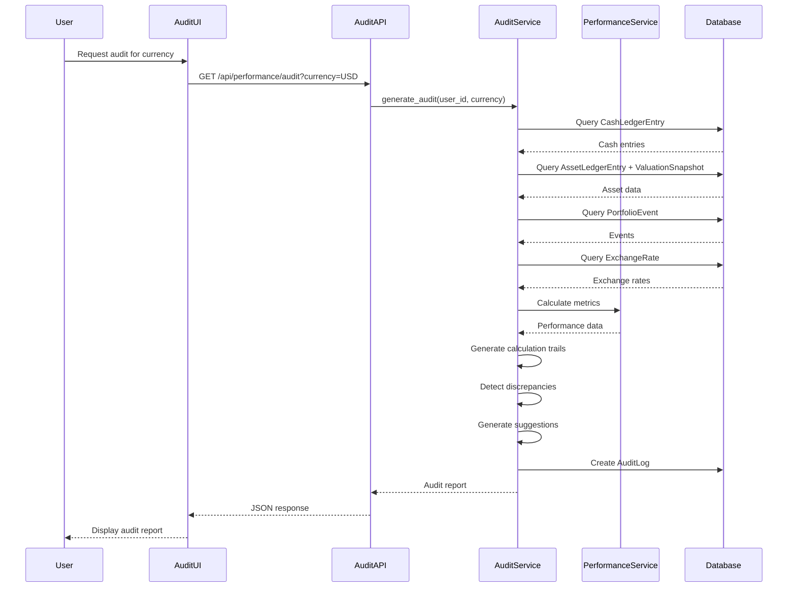

# Design Document: Performance Data Audit

## Overview

The Performance Data Audit feature provides comprehensive data verification and auditing capabilities for the portfolio performance system. It enables users to trace data sources, understand calculation processes, identify discrepancies, and verify the accuracy of performance metrics displayed on the Performance page.

## Implemented Iteration Notes

This iteration delivered the MVP audit workflow end to end across backend, API, and frontend:

- Backend service: `AuditService` in `src/investment_tracker/data/services.py`
- API routes: `src/investment_tracker/api/routes/performance.py`
- Frontend types: `frontend/src/types/audit.ts`
- Frontend API client: `frontend/src/services/audit.ts`
- Frontend page: `frontend/src/features/performance/AuditPage.tsx`
- Route and navigation wiring: `/performance/audit`, sidebar `Audit`, and Performance page `Audit Data`
- Tests: `tests/test_audit_service.py` and audit route coverage in `tests/test_day5_api_routes.py`

Delivered capabilities:

- Single-currency and all-currency performance audits
- Cash ledger breakdown by event type with running balances
- Asset quantity and valuation breakdown with estimated and quantity-based valuation markers
- Historical input breakdown for `FX_BUY`, `FX_SELL`, `FX_SWAP`, and `MANUAL_ADJUSTMENT`
- Calculation trails for Native Assets, Value CNY, Investment PnL, and FX PnL
- Exchange-rate verification notes including source, timestamp, and estimated/missing status
- Expected-value comparison for cash, assets, and CNY value with severity labels
- Correction suggestions mapped to likely source records
- Audit log persistence and history/detail retrieval
- Frontend JSON and CSV export for the current report
- Manual latest-rate refresh on the audit page so Calculation Trail can pick up refreshed current FX rates without waiting for a background job
- Positions overview alignment with `/api/performance`, so audit totals and positions totals use the same portfolio-level closure
- Row-level `Investment PnL` and `FX PnL` exposure on Positions for foreign amount-valued assets and foreign cash pools

Usage:

1. Start the API with `UV_CACHE_DIR=/tmp/uv-cache uv run uvicorn investment_tracker.api.main:app --reload`.
2. Start the frontend from `frontend/` with `npm run dev`.
3. Open `/performance/audit`.
4. Choose a currency or keep `All Currencies`.
5. Optionally enter expected values for cash, assets, or CNY value, then click `Compare`.
6. Review the breakdown sections in this order: Cash Breakdown, Asset Breakdown, Historical Input, Calculation Trail, Discrepancies, Correction Suggestions.
7. Use Audit History to reopen prior reports, or export the current report with JSON/CSV.

API examples:

```bash
curl "http://127.0.0.1:8000/api/performance/audit?user_id=1&currency=USD&expected_cash=10000&expected_value_cny=70000"
curl "http://127.0.0.1:8000/api/performance/audit-history?user_id=1&limit=20"
curl "http://127.0.0.1:8000/api/performance/audit/1?user_id=1"
```

Verification commands used for this iteration:

```bash
UV_CACHE_DIR=/tmp/uv-cache uv run pytest
UV_CACHE_DIR=/tmp/uv-cache uv run ruff check .
cd frontend && npm run lint
```

Deferred optional work:

- Frontend service/component tests are still optional because the frontend project currently has no test runner configured.
- Deeper browser-level interaction tests can be added when a frontend testing stack is introduced.
- Funding-source attribution for per-product RMB cost basis is still deferred. Current audit and positions logic use asset-ledger row FX rates, not provenance-aware funding allocation across FX buys, swaps, redemptions, and prior cash balances.

### Purpose

This feature addresses the need for data transparency and accuracy verification in performance calculations by:
- Providing detailed traceability of all data sources contributing to performance metrics
- Generating step-by-step calculation trails showing how metrics are derived
- Detecting and highlighting discrepancies between calculated and expected values
- Offering correction suggestions when data inconsistencies are found
- Maintaining audit history for data quality monitoring over time

### Scope

**In Scope:**
- Currency pool data traceability (cash, assets, historical net input)
- Calculation trail generation for all performance metrics
- Cash balance and asset valuation breakdowns
- Discrepancy detection and reporting
- Multi-currency audit reports
- Exchange rate verification
- REST API endpoints for audit data retrieval
- Frontend audit interface
- Data correction suggestions
- Audit history tracking

**Out of Scope:**
- Automatic data correction (manual review required)
- Real-time audit monitoring
- Performance optimization recommendations
- Historical performance trend analysis
- Automated reconciliation with external bank systems

## Architecture

### System Components



### Component Responsibilities

**AuditService**
- Orchestrates audit data collection from multiple sources
- Generates calculation trails for performance metrics
- Performs discrepancy detection and analysis
- Creates audit reports with detailed breakdowns
- Generates data correction suggestions
- Records audit history in AuditLog table

**AuditAPI**
- Exposes REST endpoints for audit data retrieval
- Handles request validation and error responses
- Formats audit data for frontend consumption
- Manages audit history queries

**AuditUI**
- Provides user interface for viewing audit reports
- Displays currency-specific breakdowns
- Highlights discrepancies with color coding
- Allows users to input expected values for comparison
- Shows audit history and trends

### Data Flow



## Components and Interfaces

### Backend Components

#### AuditService

**Location:** `src/investment_tracker/data/services.py`

**Class Definition:**
```python
class AuditService:
    """Service for generating performance data audit reports."""
    
    def __init__(self, session: Session) -> None:
        self.session = session
        self.performance_service = PerformanceService(session)
        self.exchange_rate_service = ExchangeRateService(session)
    
    def generate_audit(
        self,
        *,
        user_id: int,
        currency: Optional[str] = None,
        valuation_time: Optional[datetime] = None,
        expected_values: Optional[Dict[str, Any]] = None
    ) -> Dict[str, Any]:
        """Generate comprehensive audit report for currency pool(s)."""
        pass
    
    def get_cash_breakdown(
        self,
        *,
        user_id: int,
        currency: str,
        valuation_time: Optional[datetime] = None
    ) -> Dict[str, Any]:
        """Get detailed cash balance breakdown for a currency."""
        pass
    
    def get_asset_breakdown(
        self,
        *,
        user_id: int,
        currency: str,
        valuation_time: Optional[datetime] = None
    ) -> Dict[str, Any]:
        """Get detailed asset valuation breakdown for a currency."""
        pass
    
    def get_historical_input_breakdown(
        self,
        *,
        user_id: int,
        currency: str
    ) -> Dict[str, Any]:
        """Get historical net input calculation breakdown."""
        pass
    
    def generate_calculation_trail(
        self,
        *,
        currency_data: Dict[str, Any],
        exchange_rate: Decimal,
        currency: str
    ) -> Dict[str, Any]:
        """Generate step-by-step calculation trail for metrics."""
        pass
    
    def detect_discrepancies(
        self,
        *,
        calculated: Dict[str, Any],
        expected: Dict[str, Any],
        threshold: Decimal = Decimal("0.01")
    ) -> List[Dict[str, Any]]:
        """Detect discrepancies between calculated and expected values."""
        pass
    
    def generate_correction_suggestions(
        self,
        *,
        discrepancies: List[Dict[str, Any]],
        currency: str,
        user_id: int
    ) -> List[Dict[str, Any]]:
        """Generate correction suggestions for identified discrepancies."""
        pass
    
    def create_audit_log(
        self,
        *,
        user_id: int,
        currencies_audited: List[str],
        discrepancies_found: int,
        audit_details: Dict[str, Any]
    ) -> AuditLog:
        """Create audit log record."""
        pass
    
    def get_audit_history(
        self,
        *,
        user_id: int,
        limit: int = 50
    ) -> List[Dict[str, Any]]:
        """Retrieve audit history for user."""
        pass
```

#### API Endpoints

**Location:** `src/investment_tracker/api/routes/performance.py`

**Endpoint 1: Generate Audit Report**
```python
@router.get("/api/performance/audit")
async def get_performance_audit(
    user_id: int = 1,
    currency: Optional[str] = None,
    valuation_time: Optional[str] = None,
    expected_cash: Optional[float] = None,
    expected_assets: Optional[float] = None,
    expected_value_cny: Optional[float] = None
) -> dict:
    """
    Generate performance audit report for specified currency or all currencies.
    
    Query Parameters:
    - user_id: User identifier (default: 1)
    - currency: Currency code (e.g., "USD", "EUR"). If omitted, audits all currencies
    - valuation_time: ISO 8601 timestamp for point-in-time audit
    - expected_cash: Expected cash balance for discrepancy detection
    - expected_assets: Expected asset market value for discrepancy detection
    - expected_value_cny: Expected total value in CNY for discrepancy detection
    
    Returns:
    {
        "audit_id": "string",
        "audit_time": "ISO 8601 timestamp",
        "user_id": 1,
        "currencies_audited": ["USD", "EUR"],
        "summary": {
            "total_discrepancies": 2,
            "currencies_with_issues": ["USD"],
            "data_quality_score": 95.5
        },
        "by_currency": [
            {
                "currency": "USD",
                "cash_breakdown": {...},
                "asset_breakdown": {...},
                "historical_input_breakdown": {...},
                "calculation_trail": {...},
                "discrepancies": [...],
                "correction_suggestions": [...]
            }
        ],
        "data_quality": {
            "missing_rates": [],
            "missing_valuations": [],
            "estimated_values": []
        }
    }
    """
    pass

**Endpoint 2: Get Audit History**
```python
@router.get("/api/performance/audit-history")
async def get_audit_history(
    user_id: int = 1,
    limit: int = 50
) -> dict:
    """
    Retrieve audit history for user.
    
    Query Parameters:
    - user_id: User identifier (default: 1)
    - limit: Maximum number of audit logs to return (default: 50)
    
    Returns:
    {
        "audit_logs": [
            {
                "id": 1,
                "audit_time": "ISO 8601 timestamp",
                "currencies_audited": ["USD", "EUR"],
                "discrepancies_found": 2,
                "summary": {...}
            }
        ]
    }
    """
    pass

**Endpoint 3: Get Audit Detail**
```python
@router.get("/api/performance/audit/{audit_id}")
async def get_audit_detail(
    audit_id: int,
    user_id: int = 1
) -> dict:
    """
    Retrieve detailed audit report from history.
    
    Path Parameters:
    - audit_id: Audit log identifier
    
    Query Parameters:
    - user_id: User identifier (default: 1)
    
    Returns: Same structure as /api/performance/audit
    """
    pass
```

### Frontend Components

#### AuditPage Component

**Location:** `frontend/src/features/performance/AuditPage.tsx`

**Component Structure:**
```typescript
interface AuditPageProps {
  // Optional: can be embedded in PerformancePage or standalone
}

export default function AuditPage() {
  // State management
  const [selectedCurrency, setSelectedCurrency] = useState<string | null>(null);
  const [expectedValues, setExpectedValues] = useState<ExpectedValues>({});
  const [expandedSections, setExpandedSections] = useState<Set<string>>(new Set());
  
  // Data fetching
  const auditQuery = useQuery({
    queryKey: ['audit', userId, selectedCurrency, expectedValues],
    queryFn: () => getAudit(userId, selectedCurrency, expectedValues)
  });
  
  // Render sections
  return (
    <Stack spacing={3}>
      <AuditHeader />
      <CurrencySelector />
      <ExpectedValuesForm />
      <AuditSummary />
      <CashBreakdownSection />
      <AssetBreakdownSection />
      <CalculationTrailSection />
      <DiscrepanciesSection />
      <CorrectionSuggestionsSection />
      <AuditHistorySection />
    </Stack>
  );
}
```

#### Sub-Components

**CashBreakdownSection**
- Displays all CashLedgerEntry records for currency
- Groups by event type
- Shows running balances
- Highlights external flows

**AssetBreakdownSection**
- Lists all assets in currency
- Shows quantity, price, market value
- Indicates valuation source and timestamp
- Flags estimated valuations

**CalculationTrailSection**
- Displays step-by-step calculations
- Shows formulas with actual values
- Highlights exchange rates used
- Expandable intermediate steps

**DiscrepanciesSection**
- Color-coded discrepancy indicators
- Shows absolute and percentage differences
- Links to relevant data sources
- Provides drill-down capability

**CorrectionSuggestionsSection**
- Lists suggested actions
- Ranks by likelihood
- Provides links to correction workflows
- Shows impact of corrections

#### Service Layer

**Location:** `frontend/src/services/audit.ts`

```typescript
export interface AuditRequest {
  userId: number;
  currency?: string;
  valuationTime?: string;
  expectedCash?: number;
  expectedAssets?: number;
  expectedValueCny?: number;
}

export interface AuditResponse {
  audit_id: string;
  audit_time: string;
  user_id: number;
  currencies_audited: string[];
  summary: AuditSummary;
  by_currency: CurrencyAudit[];
  data_quality: DataQuality;
}

export async function getAudit(
  userId: number,
  currency?: string,
  expectedValues?: ExpectedValues
): Promise<AuditResponse> {
  const params = new URLSearchParams({
    user_id: userId.toString(),
    ...(currency && { currency }),
    ...(expectedValues?.cash && { expected_cash: expectedValues.cash.toString() }),
    ...(expectedValues?.assets && { expected_assets: expectedValues.assets.toString() }),
    ...(expectedValues?.valueCny && { expected_value_cny: expectedValues.valueCny.toString() })
  });
  
  const response = await api.get(`/api/performance/audit?${params}`);
  return response.data;
}

export async function getAuditHistory(
  userId: number,
  limit: number = 50
): Promise<AuditHistoryResponse> {
  const response = await api.get('/api/performance/audit-history', {
    params: { user_id: userId, limit }
  });
  return response.data;
}
```

#### Type Definitions

**Location:** `frontend/src/types/audit.ts`

```typescript
export interface CashBreakdownEntry {
  id: number;
  event_id: number;
  event_time: string;
  event_type: string;
  amount_delta: number;
  running_balance: number;
  is_external_flow: boolean;
  fx_rate_to_cny: number | null;
  rmb_amount: number | null;
  description: string | null;
}

export interface AssetBreakdownEntry {
  asset_id: number;
  asset_code: string;
  asset_name: string;
  asset_type: string;
  current_quantity: number;
  latest_valuation_price: number | null;
  market_value: number;
  valuation_time: string | null;
  valuation_source: string;
  is_estimated: boolean;
}

export interface HistoricalInputEntry {
  event_id: number;
  event_time: string;
  event_type: string;
  native_amount_delta: number;
  rmb_amount: number;
  rmb_source: 'direct' | 'calculated';
  fx_rate_used: number | null;
}

export interface CalculationStep {
  step_number: number;
  description: string;
  formula: string;
  inputs: Record<string, number>;
  result: number;
  notes: string[];
}

export interface Discrepancy {
  metric: string;
  calculated_value: number;
  expected_value: number;
  absolute_difference: number;
  percentage_difference: number;
  severity: 'error' | 'warning' | 'info';
}

export interface CorrectionSuggestion {
  suggestion_id: string;
  discrepancy_metric: string;
  suggested_action: string;
  likelihood: 'high' | 'medium' | 'low';
  details: string;
  affected_records: string[];
}

export interface CurrencyAudit {
  currency: string;
  cash_breakdown: {
    entries: CashBreakdownEntry[];
    subtotals: Record<string, number>;
    total_balance: number;
  };
  asset_breakdown: {
    entries: AssetBreakdownEntry[];
    total_market_value: number;
  };
  historical_input_breakdown: {
    entries: HistoricalInputEntry[];
    total_native_invested: number;
    total_cny_invested: number;
  };
  calculation_trail: {
    native_assets: CalculationStep[];
    value_cny: CalculationStep[];
    investment_pnl: CalculationStep[];
    fx_pnl: CalculationStep[];
  };
  discrepancies: Discrepancy[];
  correction_suggestions: CorrectionSuggestion[];
}

export interface AuditSummary {
  total_discrepancies: number;
  currencies_with_issues: string[];
  data_quality_score: number;
}

export interface DataQuality {
  missing_rates: string[];
  missing_valuations: Array<{
    asset_id: number;
    asset_code: string;
    currency: string;
  }>;
  estimated_values: Array<{
    asset_id: number;
    currency: string;
    market_value: number;
  }>;
}
```

## Data Models

### Database Schema Changes

**AuditLog Table Enhancement**

The existing `AuditLog` table will be used to store audit history. The `details_json` column will store the complete audit report.

**Schema:**
```sql
CREATE TABLE audit_logs (
    id INTEGER PRIMARY KEY,
    user_id INTEGER REFERENCES users(id),
    entity_type VARCHAR(64) NOT NULL,  -- 'performance_audit'
    entity_id VARCHAR(64) NOT NULL,    -- audit_id (UUID)
    action VARCHAR(64) NOT NULL,       -- 'audit_generated'
    status VARCHAR(32) NOT NULL,       -- 'completed', 'failed'
    details_json JSON,                 -- Complete audit report
    created_at TIMESTAMP WITH TIME ZONE NOT NULL
);
```

**details_json Structure:**
```json
{
  "currencies_audited": ["USD", "EUR"],
  "discrepancies_found": 2,
  "summary": {
    "total_discrepancies": 2,
    "currencies_with_issues": ["USD"],
    "data_quality_score": 95.5
  },
  "audit_report": {
    "by_currency": [...],
    "data_quality": {...}
  }
}
```

### No New Tables Required

The audit feature leverages existing tables:
- `CashLedgerEntry` - Source data for cash breakdowns
- `AssetLedgerEntry` - Source data for asset quantity tracking
- `ValuationSnapshot` - Source data for asset valuations
- `PortfolioEvent` - Source data for event details and historical input
- `ExchangeRate` - Source data for FX rate verification
- `Asset` - Asset metadata
- `AuditLog` - Audit history storage

## Error Handling

### Error Categories

**1. Data Validation Errors**
- Invalid currency code
- Invalid user_id
- Invalid expected values (negative numbers, non-numeric)
- Invalid valuation_time format

**Response:**
```json
{
  "error": {
    "code": "VALIDATION_ERROR",
    "message": "Invalid currency code: XYZ",
    "details": {
      "field": "currency",
      "value": "XYZ",
      "valid_currencies": ["USD", "EUR", "CAD", "AUD", "CNY"]
    }
  }
}
```

**2. Missing Data Errors**
- No data found for currency
- No exchange rates available
- No valuation snapshots for assets

**Response:**
```json
{
  "error": {
    "code": "MISSING_DATA",
    "message": "No data found for currency: USD",
    "details": {
      "currency": "USD",
      "user_id": 1,
      "suggestion": "Ensure transactions have been imported for this currency"
    }
  }
}
```

**3. Calculation Errors**
- Division by zero in percentage calculations
- Missing exchange rates preventing CNY conversion
- Inconsistent data states

**Handling Strategy:**
- Continue audit with partial data
- Flag affected calculations as "INCOMPLETE"
- Include error details in audit report
- Do not fail entire audit for single currency issues

**Response:**
```json
{
  "audit_id": "...",
  "by_currency": [
    {
      "currency": "USD",
      "status": "INCOMPLETE",
      "errors": [
        {
          "code": "MISSING_EXCHANGE_RATE",
          "message": "Cannot calculate Value CNY: exchange rate not available",
          "affected_metrics": ["value_cny", "investment_pnl_cny", "fx_pnl_cny"]
        }
      ],
      "cash_breakdown": {...},
      "asset_breakdown": {...}
    }
  ]
}
```

**4. System Errors**
- Database connection failures
- Service unavailability
- Timeout errors

**Response:**
```json
{
  "error": {
    "code": "INTERNAL_ERROR",
    "message": "Failed to generate audit report",
    "details": {
      "error_id": "uuid",
      "timestamp": "ISO 8601",
      "suggestion": "Please try again. If the problem persists, contact support."
    }
  }
}
```

### Error Handling in Frontend

```typescript
try {
  const audit = await getAudit(userId, currency, expectedValues);
  setAuditData(audit);
} catch (error) {
  if (error.response?.status === 400) {
    // Validation error - show user-friendly message
    showNotification('error', error.response.data.error.message);
  } else if (error.response?.status === 404) {
    // No data found
    showNotification('warning', 'No audit data available for selected currency');
  } else {
    // System error
    showNotification('error', 'Failed to generate audit report. Please try again.');
  }
}
```

## Testing Strategy

### Unit Testing

**Backend Unit Tests**

**Test Suite: AuditService**
- `test_get_cash_breakdown_single_currency()` - Verify cash entries are correctly retrieved and grouped
- `test_get_cash_breakdown_excludes_cny_external_flows()` - Verify CNY external flows are excluded per business logic
- `test_get_asset_breakdown_with_valuations()` - Verify assets with ValuationSnapshot are correctly valued
- `test_get_asset_breakdown_amount_valued_assets()` - Verify BOND/FUND/WEALTH_PRODUCT use quantity as market value when no snapshot
- `test_get_historical_input_breakdown()` - Verify only INVESTMENT_POOL_EVENTS are included
- `test_generate_calculation_trail()` - Verify calculation steps are correctly generated
- `test_detect_discrepancies_within_threshold()` - Verify discrepancies below threshold are not flagged
- `test_detect_discrepancies_above_threshold()` - Verify discrepancies above threshold are flagged
- `test_generate_correction_suggestions_cash_discrepancy()` - Verify suggestions for cash balance issues
- `test_generate_correction_suggestions_asset_discrepancy()` - Verify suggestions for asset valuation issues
- `test_create_audit_log()` - Verify audit log is correctly created
- `test_get_audit_history()` - Verify audit history retrieval

**Test Suite: API Endpoints**
- `test_get_performance_audit_single_currency()` - Verify endpoint returns audit for specified currency
- `test_get_performance_audit_all_currencies()` - Verify endpoint returns audit for all currencies when currency not specified
- `test_get_performance_audit_with_expected_values()` - Verify discrepancy detection works with expected values
- `test_get_performance_audit_invalid_currency()` - Verify 400 error for invalid currency
- `test_get_audit_history()` - Verify audit history endpoint
- `test_get_audit_detail()` - Verify audit detail retrieval from history

**Frontend Unit Tests**

**Test Suite: AuditPage Component**
- `test_renders_currency_selector()` - Verify currency selector is displayed
- `test_renders_expected_values_form()` - Verify expected values input form
- `test_displays_cash_breakdown()` - Verify cash breakdown section renders correctly
- `test_displays_asset_breakdown()` - Verify asset breakdown section renders correctly
- `test_displays_calculation_trail()` - Verify calculation trail section renders correctly
- `test_highlights_discrepancies()` - Verify discrepancies are color-coded
- `test_displays_correction_suggestions()` - Verify correction suggestions are displayed
- `test_expandable_sections()` - Verify sections can be expanded/collapsed

**Test Suite: Audit Service**
- `test_getAudit_constructs_correct_url()` - Verify API call with correct parameters
- `test_getAudit_handles_error_response()` - Verify error handling
- `test_getAuditHistory_returns_logs()` - Verify audit history retrieval

### Integration Testing

**Backend Integration Tests**
- `test_full_audit_workflow_usd()` - End-to-end audit for USD currency pool
- `test_full_audit_workflow_all_currencies()` - End-to-end audit for all currencies
- `test_audit_with_missing_exchange_rates()` - Verify audit handles missing rates gracefully
- `test_audit_with_missing_valuations()` - Verify audit handles missing valuations
- `test_audit_discrepancy_detection_integration()` - Verify discrepancy detection with real data
- `test_audit_log_creation_and_retrieval()` - Verify audit history workflow

**Frontend Integration Tests**
- `test_audit_page_full_workflow()` - User selects currency, views audit, inputs expected values
- `test_audit_page_discrepancy_highlighting()` - Verify discrepancies are highlighted in UI
- `test_audit_page_correction_suggestions_interaction()` - User views and acts on suggestions
- `test_audit_history_navigation()` - User navigates to past audit reports

### Example-Based Tests

**Specific Scenarios**
- `test_audit_usd_pool_with_bonds_and_cash()` - Audit USD pool with mixed assets
- `test_audit_eur_pool_with_estimated_valuations()` - Audit EUR pool with estimated values
- `test_audit_detects_missing_cash_entry()` - Discrepancy detection for missing transaction
- `test_audit_detects_incorrect_exchange_rate()` - Discrepancy detection for wrong FX rate
- `test_audit_suggests_valuation_snapshot_creation()` - Correction suggestion for missing valuation

### Edge Cases

**Backend Edge Cases**
- Empty currency pool (no cash, no assets)
- Currency with only cash, no assets
- Currency with only assets, no cash
- All exchange rates missing
- All valuations estimated
- Historical net input is zero
- Negative cash balance
- Zero quantity assets
- Very large numbers (precision testing)
- Concurrent audit requests

**Frontend Edge Cases**
- No currencies available
- All currencies have discrepancies
- Very long asset lists (pagination/virtualization)
- Network timeout during audit
- Partial audit data (some currencies failed)

### Test Data Setup

**Fixtures:**
```python
@pytest.fixture
def sample_cash_entries():
    return [
        CashLedgerEntry(
            event_id=1,
            user_id=1,
            currency="USD",
            amount_delta=Decimal("1000.00"),
            is_external_flow=False,
            fx_rate_to_cny=Decimal("7.2"),
            rmb_amount=Decimal("7200.00")
        ),
        # ... more entries
    ]

@pytest.fixture
def sample_asset_entries():
    return [
        AssetLedgerEntry(
            event_id=2,
            user_id=1,
            asset_id=1,
            quantity_delta=Decimal("10.0"),
            cash_currency="USD",
            cash_amount=Decimal("-500.00")
        ),
        # ... more entries
    ]

@pytest.fixture
def sample_valuations():
    return [
        ValuationSnapshot(
            user_id=1,
            asset_id=1,
            valuation_time=datetime.now(timezone.utc),
            quantity=Decimal("10.0"),
            price=Decimal("55.0"),
            market_value=Decimal("550.0"),
            currency="USD",
            source="manual",
            is_estimated=False
        ),
        # ... more valuations
    ]
```

### Test Coverage Goals

- Backend service layer: 90%+ coverage
- API endpoints: 100% coverage
- Frontend components: 80%+ coverage
- Integration tests: All critical user workflows
- Edge cases: All identified edge cases covered

### Why Property-Based Testing Is Not Applicable

Property-based testing (PBT) is **not appropriate** for this feature because:

1. **Data Retrieval Operations** - The core functionality involves querying and aggregating database records, not pure algorithmic transformations
2. **Reporting and Formatting** - The feature primarily presents data in structured formats rather than computing universal properties
3. **Side-Effect Operations** - Creating audit logs and database queries are side-effect operations without return values to assert properties on
4. **Integration-Heavy** - Behavior depends on database state and external data, not just input parameters
5. **No Universal Properties** - There are no meaningful "for all inputs X, property P(X) holds" statements for data retrieval and reporting

**Appropriate Testing Strategy:**
- **Example-based unit tests** with known fixtures for service methods
- **Integration tests** with test database to verify end-to-end workflows
- **Snapshot tests** for audit report structure consistency
- **Mock-based tests** for API endpoints to verify correct service calls

This approach provides comprehensive coverage for data retrieval, aggregation, and reporting functionality without the overhead of property-based testing infrastructure.
